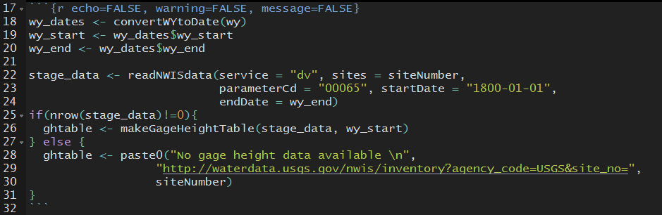
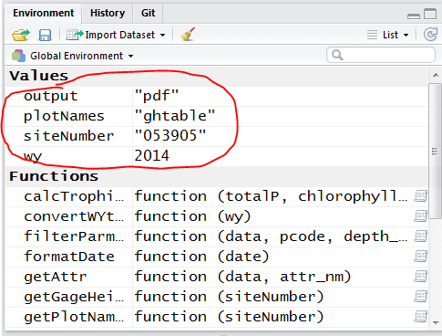
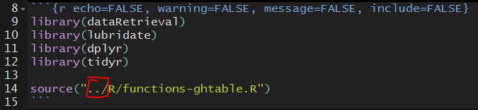
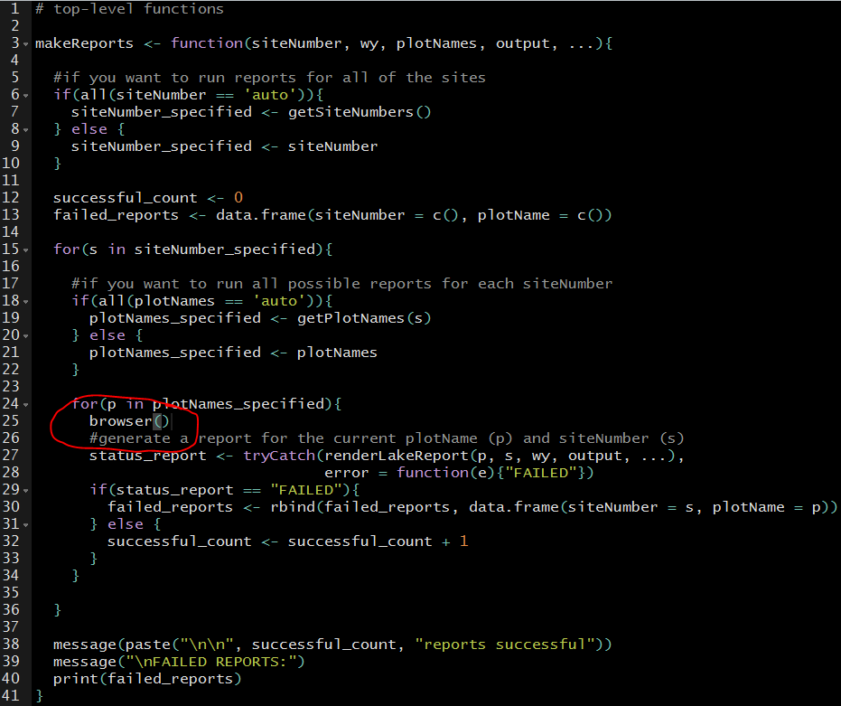
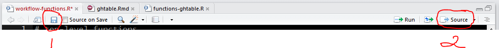
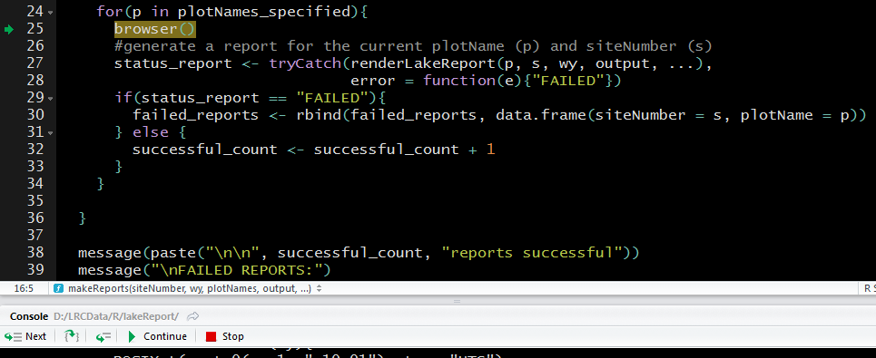
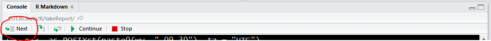

There are two ways these reports could error: within the R Markdown and within the R Script. 

## Error message from R Markdown file

This is a fabricated example and will always error because we are supplying an incomplete site number. However, it illustrates what you would do in any R Markdown debugging situation.

```{r eval=FALSE}
# incomplete site number
wy <- 2014
siteNumber <- '053905'
plotNames <- 'ghtable'
output <- 'pdf'
makeReports(siteNumber, wy, plotNames, output)
```

You should see an error that says something similar to "Quitting from lines..." followed by the file name. This really doesn't tell you too much. You will need to manually step through the R Markdown to figure out why it is erring in that code chunk.

```
Request failed [400]. Retrying in 1 seconds...
Request failed [400]. Retrying in 1 seconds...
For: https://waterservices.usgs.gov/nwis/dv/?sites=053905&parameterCd=00065&startDT=1800-01-01&endDT=2014-09-30&format=waterml,1.1&

Quitting from lines 18-32 (ghtable.Rmd) 
```

First, navigate to your R Markdown file (Report_templates >> ghtable.Rmd) and find the code chunk corresponding to those lines. This example quits from 18-22.


<br>

Debugging R Markdown files requires us to manually execute each line. This means we need to execute everything that comes before our chunk that fails. It also expects that `siteNumber`, `wy`, and any other arguments passed into `makeReports` are already in the environment.


<br>

You should be able to highlight and click CTRL + ENTR for each code chunk preceding the error. Note: for the `source` call that loads the report-specific functions, remove the "../" and then run. Or manually navigate to that file (R >> functions-ghtable.R) and click "source".


<br>

You should now be able to step through your code chunk that causes the error. Run each line individually until you come across the line that causes the error. For this example, it is the line using `readNWISdata` which makes since because it can't retrieve data from a site that doesn't exist. To determine what the error could be caused from, inspect the variables in your environment and determine if they are what you expect them to be.

If the error is from a report-specific function, you will need to debug that function (see the next section).

## Error message from a function in a lakeReport .R file

If an error is occurring inside one of the lakeReport functions, you should navigate to that file (R >> ghtable.R) and insert `browser()` above the line that is causing the issue. Then, re-source that file and re-execute your code that called this function. Our example for ghtable erred prior to the report-specific functions, but did have to pass through `makeReports`, so we will debug that function. 

### Step 1: insert `browser()`


<br>

### Step 2: save and source the change to the function


<br>

### Step 3: re-execute code, and pause at `browser()`


<br>

### Step 4: Use debug buttons (Next) to step through code. 

Inspect the environment when new variables are created and see what looks strange. When you are done, press "Stop". Put in your fix (either to data or code). Remove `browser()` and save/source again. Then re-run, and you shouldn't have errors.


<br>
